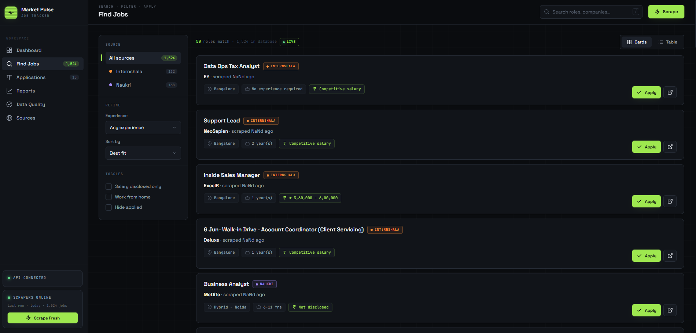
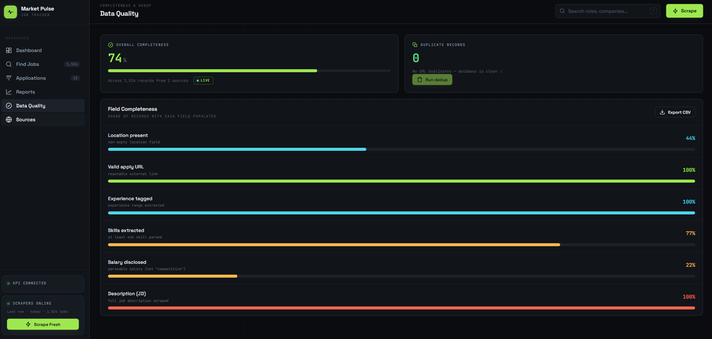
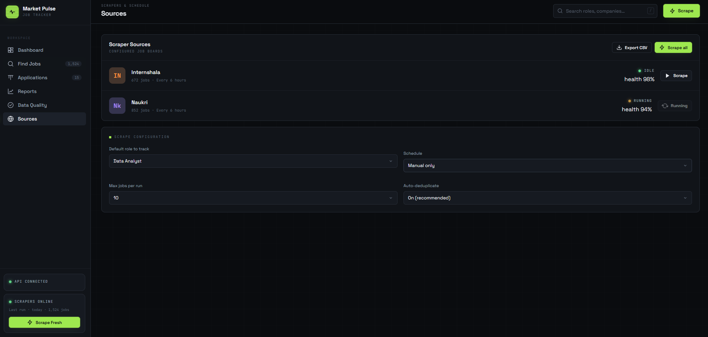

# Job Market Pulse

## 🚀 Data Engineering Pipeline

An end-to-end **batch ETL/ELT pipeline** orchestrated with **Apache Airflow**, transforming real-world job data through **PySpark**, and loading into a **GCP data warehouse** (BigQuery). The pipeline is containerized with Docker and runs daily, processing **2,460+ job records** from PostgreSQL → GCS data lake → BigQuery warehouse with automated data-quality gates.

```
┌─────────────────────────────────────────────────────────────┐
│                 Job Market Pulse — Data Pipeline            │
├─────────────────────────────────────────────────────────────┤
│
│  PostgreSQL (2,460 jobs)
│         │
│         ▼ [extract_to_gcs]
│  GCS Raw Bucket (parquet, partitioned by ingest_date)
│         │
│         ▼ [transform] PySpark: dedup, enrichment, DQ gate
│  GCS Processed Bucket (parquet, partitioned by source)
│         │
│         ▼ [load_bigquery] Free batch load (hive partitioning)
│  BigQuery Warehouse (job_market_warehouse.jobs)
│         │
│         ▼ [data_quality_check] Row count assertion
│  ✅ Pipeline passes
│
│  Stack: Apache Airflow (LocalExecutor, Docker)
│         PySpark 4.0 | OpenJDK 17 | Google Cloud SDK
│         pytest (29 tests) | GitHub Actions CI/CD
│
└─────────────────────────────────────────────────────────────┘
```

**Key highlights:**
- **Orchestration:** 5-stage DAG (extract → transform → upload → load → quality-check) with automated retries, daily scheduling
- **Transformation:** PySpark SQL: deduplication (URL + title/company/source), schema normalization, field enrichment (salary parsing, location standardization)
- **Data Quality:** Row-level validations (required-field gate, dedup keys, post-load assertions)
- **Infrastructure:** Custom Docker image (Spark + Cloud SDK + Airflow), docker-compose stack, environment-based secrets
- **Testing & CI:** 29-case pytest suite for validation layer, GitHub Actions runs on every push
- **Code:** All pipeline code is version-controlled; `.env` secrets are gitignored

The pipeline sources data from the analytics platform below and lands analytics-ready data in BigQuery for BI/reporting.

---

## 📊 Full-Stack Analytics Platform

A personal job market analytics platform built to demonstrate end-to-end data skills — from automated data collection to structured storage, quality validation, and visual reporting. Tracks **2,460 real job listings** across India's top tech cities, sourced live from Naukri and Internshala.

> **Dual portfolio:** Data Engineering (Airflow/PySpark pipeline → warehouse) + Software Engineering (Flask API + Power BI dashboards)

---

## Skills Demonstrated

| Skill Area | What's Built |
|---|---|
| **Data Collection** | Automated web scrapers (Selenium) pulling live listings from 2 job boards |
| **Data Sourcing** | 14 CS/IT roles × 4 cities — structured coverage across the Indian tech market |
| **Data Cleaning** | Salary normalization, location standardization, deduplication pipeline |
| **Data Quality** | Field completeness scoring, duplicate detection, schema validation before every insert |
| **SQL & Databases** | PostgreSQL — schema design, parameterized queries, aggregation, trend analysis |
| **Python** | End-to-end pipeline: scraping, parsing, transformation, unstructured text extraction |
| **Data Visualization** | Power BI dashboard connected directly to PostgreSQL — market insights at a glance |
| **Analytics** | Jobs by source, top roles by demand, experience mix, location heatmap, daily trend |
| **Data Export** | One-click CSV export of the full dataset for offline analysis |

---

## Data Pipeline

```
  Naukri          Internshala
     │                 │
     └────────┬────────┘
              │  Selenium scrapers
              ▼
        Validation &          ← required fields, salary normalization,
        Cleaning Layer           location standardization
              │
              ▼
         PostgreSQL            ← deduplication on URL + title/company/source
         (1,524 jobs)
              │
     ┌────────┴────────┐
     ▼                 ▼
  Flask API         Power BI
  (search,          (dashboard,
   analytics,        charts,
   export)           market insights)
```

---

## Screenshots

### Dashboard

> **1,524 jobs** tracked across 2 sources · Top Hiring Locations (Bangalore leads with 546 open roles) · Jobs by Source donut — Naukri 56% / Internshala 44% · Top Roles by listing volume · Experience Mix: Fresher / 0–2 yr / 3–5 yr

---

### Find Jobs

> Search across **1,524 listings** with filters for source, experience level, salary minimum, WFH, and applied status. Each card shows title, company, location, experience, salary, and source — with a direct Apply link.

---

### Application Pipeline

> Kanban-style tracker across **5 stages**: Saved → Applied → Interview → Offer → Rejected. Tracks 15 active applications with salary and source visible on every card.

---

### Data Quality

> **74% overall completeness** across 1,524 records · **0 duplicate records** · Field-level breakdown: Valid apply URL 100%, Experience tagged 100%, JD scraped 100%, Skills extracted 77%, Salary disclosed 22%

---

### Sources & Scraper Health

> Live scraper health monitoring — Internshala (672 jobs · 98% health) and Naukri (852 jobs · 94% health) · Configurable role, schedule, jobs per run, and auto-deduplicate

---

## Features

**Data Collection & Sourcing**
- Scrapes Naukri and Internshala using Selenium — handles JavaScript-rendered pages with no public API
- Bulk scraper covers 14 CS/IT roles across Bangalore, Hyderabad, Mumbai, and Delhi in a single run
- JD parser extracts structured Qualifications, Requirements, and Skills from raw job description text
- Two-pass scraping: fast listing pass first, then deep JD extraction per job

**Data Quality & Validation**
- Every record passes through a validation layer before DB insert — enforces required fields, flags anomalies
- Salary normalization: raw strings like "₹5 LPA", "5-8 LPA" are standardized on ingest
- Location normalization: collapses whitespace, handles missing values
- Deduplication: URL-based match first, then title + company + source fallback
- Live quality report: overall completeness score, field-by-field breakdown, duplicate count

**Analytics & Reporting**
- Dashboard shows jobs by source, top hiring locations, most in-demand roles, experience distribution
- Daily scrape trend tracks data freshness over time
- Full CSV export for offline analysis in Excel or Power BI

**Search & Filters**
- Full-text search across title and company
- Filter by experience level, minimum salary, WFH/remote, posted within N days, applied status
- Sort by most recent or alphabetically

**Application Tracker**
- Kanban board: Saved → Applied → Interview → Offer → Rejected
- Mark applied directly from the job card — persisted to PostgreSQL
- Filter view to show only pending or already-applied listings

**Power BI Dashboard**
- Connects directly to PostgreSQL — no intermediate export needed
- Visuals: salary distribution, location heatmap, top roles treemap, source breakdown, experience donut, daily trend line

---

## Tech Stack

| | |
|---|---|
| Language | Python 3.12 |
| Database | PostgreSQL |
| Scraping | Selenium 4 |
| Backend | Flask |
| Visualization | Power BI |
| Deployment | Railway |

---

## Setup

Clone the repo, create a `.env` with your PostgreSQL credentials, and run:

```
pip install -r requirements-local.txt
python app.py
```

To seed the database: `python bulk_scrape.py`

The app is also deployed on Railway with live data — `DISABLE_SCRAPING=true` keeps the production instance read-only.

---

## License

MIT
